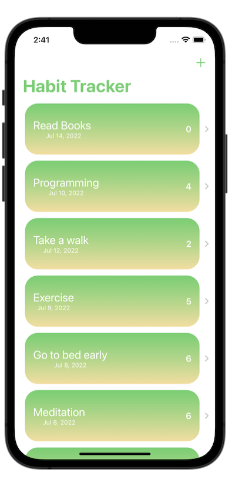
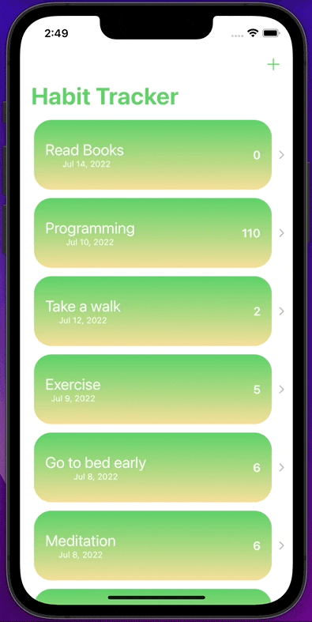

# HabitTracking
HabitTracking is a mobile application for habit tracking, created with the **Swift programming language**, **SwiftUI framework**.

## Description
- Used **UserDefaults** to stored data.

## Requirements
- Swift 5.1+
- iOS 15.0+

## Screenshots

## License

HabitTracking is available under the MIT license. See the LICENSE file for more info.

## Authors

- [@tahabozdemir](https://www.github.com/tahabozdemir)

## Support

For support, email taha@bozdemir.net

